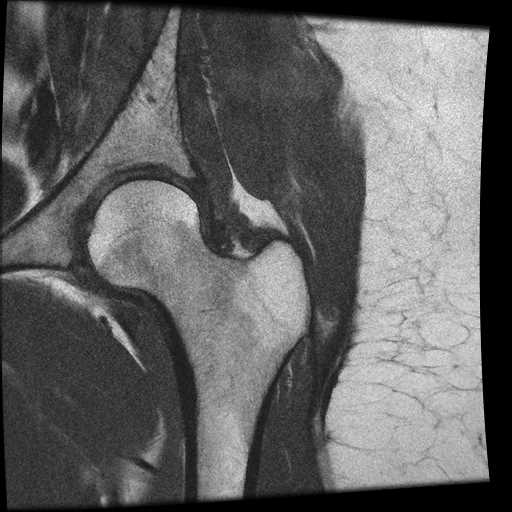
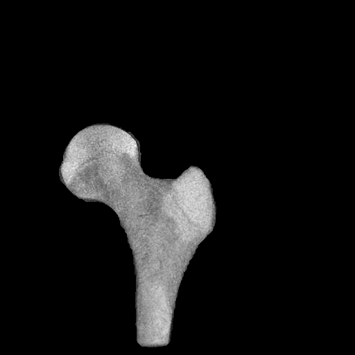
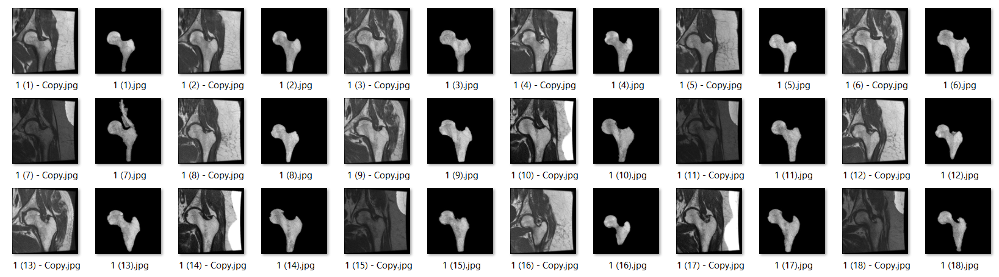

# Automatic Segmentation of The Femoral Head
## From Abdomen MRI Image
This project can be used as a preprocessing unit for different approches, specially Measuring bone density for diagnosis of Osteoporosis.

Here's the input image:

This is the output image:

And this is the row and result image after applying this algorithm:
